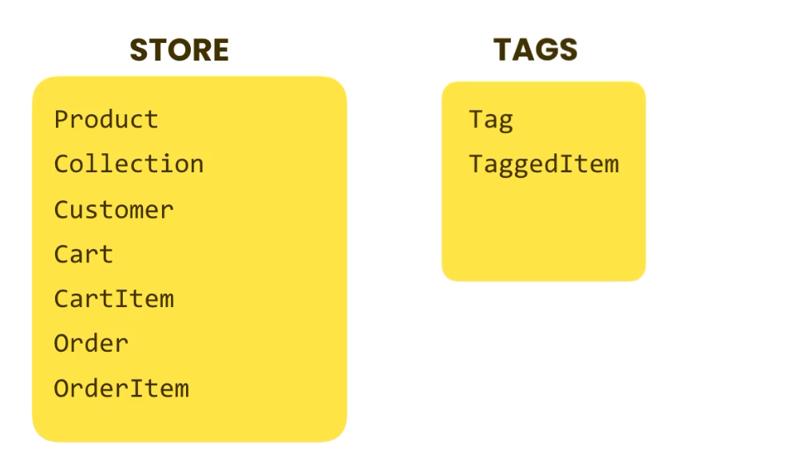

# Ecommerce Store API

Designed an Ecommerce API, based on Django, MySQL database, that provides various fundamental features of a modern ecommerce applications, which users can connect to client app, so as to make a fully fledged ecommerce application


## Features

- Sign up/login a user
- Creation/Updation/Deletion of unlimited products, along with their multiple images and other product parameters
- Tags, Likes feature for a particular product
- Sorting the products based on categories/collection
- Filtering of product based on cost, category
- Searching of products based on title, description and other fields
- Pagination feature
- Creation/updation/deletion of cart
- Providing various permissions based on groups/roles
- User profile endpoint
- Used celery to execute multiple long running tasks, and used redis as a message broker/queue in assisting the celery to work.


## Database Structure
<p align="center">
  
</p>

## ER Diagram:
[ER Diagram](https://drive.google.com/file/d/1wwywakU1TYU3B6axd5d7H0hoVutDYBYS/view?usp=sharing)


## Useful Endpoints
- http://127.0.0.1:8000/store/ : Various operations on the store
- http://127.0.0.1:8000/auth/users/ : Registration Endpoint
- http://127.0.0.1:8000/auth/jwt/create : Login Endpoint
- http://127.0.0.1:8000/auth/users/me/ : User Profile Endpoint
- http://127.0.0.1:8000/store/customers/me/ : Customer Profile Endpoint
- http://127.0.0.1:8000/store/carts/ : Cart Creation Endpoint
- http://127.0.0.1:8000/store/products/ : View all the products
- http://127.0.0.1:8000/store/products/<prod: id>/ : View details related to a particular product
- http://127.0.0.1:8000/store/carts/<cart:id>/items/ : Insert the products in a particular Cart Endpoint
- http://127.0.0.1:8000/store/carts/<cart:id>/items/<item:id>/ : Update the inserted items in the Cart
- http://127.0.0.1:8000/store/orders/ : Details of the orders by user


## Tech Stack

- **Server:** Django (Python)
- **Database:** MySQL


## Run Locally

- Clone the project

```bash
  git clone https://github.com/vibhudawar/storefront-3-final-project
```

- Go to the project directory

```bash
  cd storefront
```

- Setup virtual environment
```bash
  python3 -m venv [name of the virtual env]
```

- Activate virtual environment
```bash
  source [name of the virtual env]/bin/activate
```

- Install dependencies

```bash
  Pip  install -r requirements.txt
```

- Setup the database parameters in the settings.py under storefront application
- Make a database in the mySQL client apps such as datagrip, and then run the commands:
```bash
  python manage.py makemigrations
  python manage.py migrate
```
- Run the server:
```bash
  python manage.py runserver
```


## License

[MIT](https://choosealicense.com/licenses/mit/)

